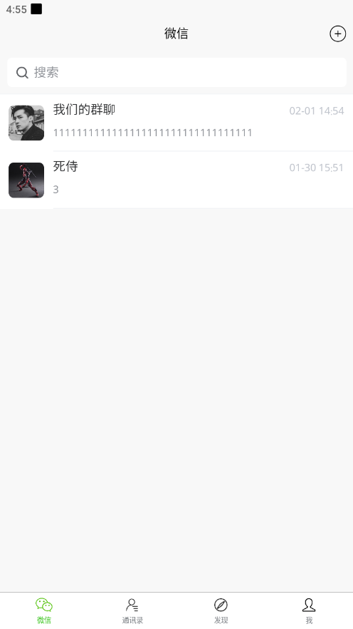
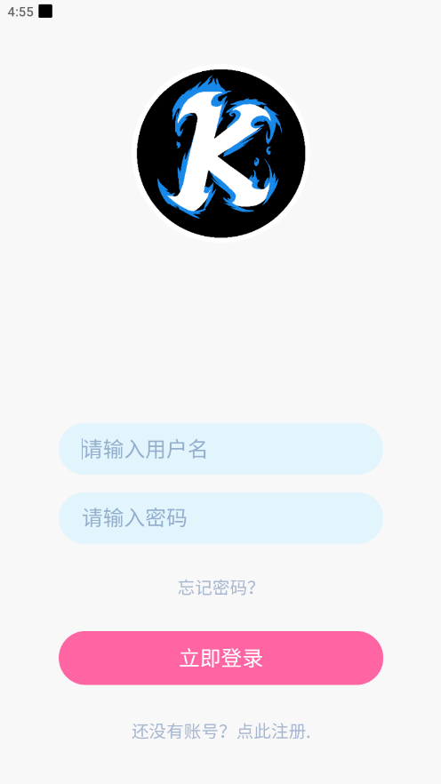

# Goim
使用 gin+mongodb+redis+websocket 开发的聊天通讯软件

> 主要为了练手，顺便试着学习一下通讯软件的思路。






# 技术栈
- Gin
- Uniapp
- Uview
- Mongodb
- Redis

## feature
- 登录/注册
- 群聊(支持文字、语音、文件(图片)上传
- 私聊
- 历史消息查看(点击加载更多)
- go mod 包管理
- 更换头像等其他信息

# TODO
- [ ] 支持 emoji
- [ ] 朋友圈
…………

# 启动教程
修改 conf目录的文件信息
然后修改文件名
```
air
或者
go run main.go
```
uniapp项目直接模拟器运行即可

# 目录介绍

api controller的目录

conf 配置文件目录

files 文件目录

internal 内部代码

logs 日志文件目录

middlewares 中间件目录

pkg 工具包

router 路由

tmp air生成的目录，以及README的一些文件

# 图片


# License
[MIT](./LICENSE.txt)
